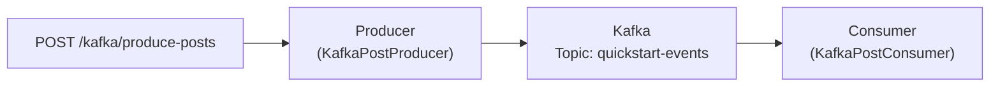
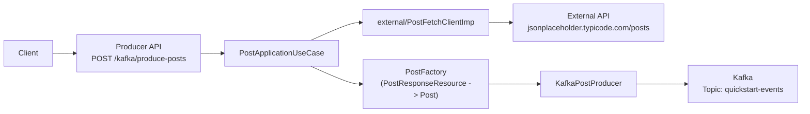

# Kafka Spring Boot App

Spring Boot + Apache Kafka で、HTTP エンドポイント経由で Kafka に JSON メッセージを送る PoC アプリです。  
`/kafka/produce-posts` を呼ぶと、外部 API から取得した Post を Kafka トピックへ送信します。

## 技術スタック

- Java 21
- Spring Boot 3.5.9
- Spring for Apache Kafka 3.3.11
- Lombok 1.18.42
- Docker Compose (Zookeeper, Kafka, Kafka UI)

## 前提条件

- Java 21
- Docker / Docker Compose

## 起動手順

1. Kafka 関連コンテナを起動

```bash
make up
```

2. トピック作成（`quickstart-events`）

```bash
make create-topic
```

3. アプリ起動

```bash
./gradlew bootRun
```

## エンドポイント

### 外部 API の Post 一覧を JSON 送信

- Method/Path: `POST /kafka/produce-posts`
- 外部 API: `https://jsonplaceholder.typicode.com/posts`
- 宛先トピック: `quickstart-events`
- キー: `post.userId` を文字列化した値
- 値: `PostRecordMessage` を `JsonSerializer` でシリアライズした JSON
- レスポンス: `Posts sent to Kafka!`

```bash
curl -X POST http://localhost:8080/kafka/produce-posts
```

送信される JSON 値の例:

```json
{
  "userId": 1,
  "id": 1,
  "title": "sunt aut facere repellat provident occaecati excepturi optio reprehenderit",
  "body": "quia et suscipit suscipit recusandae..."
}
```

## アーキテクチャ



## Producer 送信経路（API → Kafka）



## Consumer の有効化

Consumer はデフォルトで無効です（`application.yml` の `spring.kafka.consumer.enabled: false`）。

有効化する場合は `spring.kafka.consumer.enabled: true` に変更して再起動してください。  
有効化後は `KafkaPostConsumer` が `quickstart-events` を購読し、`log.info` で受信ログを出力します。

## メッセージ確認

### Kafka UI

`http://localhost:8081` にアクセスし、`quickstart-events` のメッセージを確認します。

### CLI

```bash
make consume-cli
```

## テスト実行

```bash
./gradlew test
```

## 設定値（application.yml）

- Kafka bootstrap server: `localhost:9092`
- Producer topic: `quickstart-events`
- Producer serializer: key/value とも `JsonSerializer`
- Consumer topic: `quickstart-events`
- Consumer deserializer: key=`StringDeserializer`, value=`JsonDeserializer`
- Logging level: `root=INFO`

## Makefile の主要コマンド

- `make up`: Docker コンテナを起動
- `make down`: Docker コンテナを停止
- `make restart`: コンテナを再起動
- `make logs`: コンテナログを表示
- `make ps`: コンテナ状態を表示
- `make create-topic`: `quickstart-events` を作成
- `make list-topics`: トピック一覧を表示
- `make describe-topic`: `quickstart-events` の詳細を表示
- `make consume-cli`: `quickstart-events` を先頭から購読
